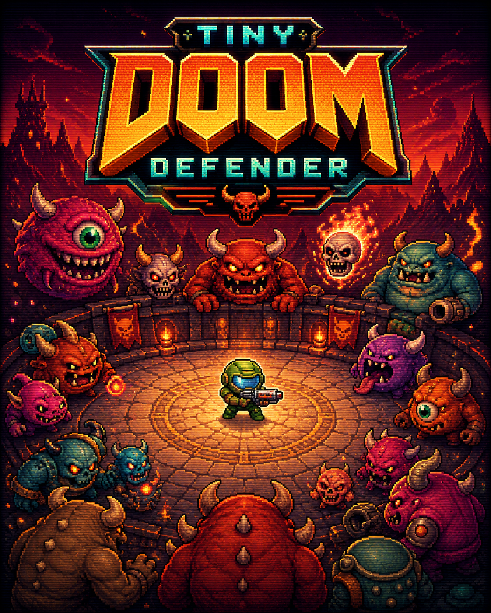

# tiny-doom-defender

Code for training a **1.1M-parameter ModernBERT** encoder that plays VizDoom's Defend the Center in real time on a CPU from pixels alone.

📝 [Read the full story/see the model play live](https://huggingface.co/spaces/anakin87/tiny-doom-defender)

🤗 [Trained models](https://huggingface.co/anakin87/tiny-doom-defender)



Inspired by [VAGOsolutions/SauerkrautLM-Doom-MultiVec-1.3M](https://huggingface.co/VAGOsolutions/SauerkrautLM-Doom-MultiVec-1.3M).

The model underwent SFT from a programmatic oracle and has been refined with PPO.

🧷 **Table of content**
- [Why?](#why)
- [Results](#results)
- [Try the model](#try-the-model)
- [Repository structure](#repository-structure)

## Why?

Some time ago VAGO Solutions released SauerkrautLM-Doom-MultiVec-1.3M: a small ModernBERT encoder model that plays Doom Defend the Center scenario in real time on a CPU. It was trained with Supervised Fine-Tuning on 31k human gameplay examples.

My first thought: cool! I love both Doom and Small Language Models.

Then another idea: I bet I can improve the model. :-)

This sounded like a fun project, to experiment with SFT + Reinforcement Learning.

I changed the architecture, added PPO on top of SFT, and got a smaller, faster and stronger Doom player.

💾 Can even fit a floppy with int8 quantization.

If I've made you curious, [read the article](https://huggingface.co/spaces/anakin87/tiny-doom-defender).

Feel free to also explore this repo: most code here is AI-generated under my supervision.

## Results

Evaluation on 1000 test episodes.

| Model | Model size | Training | Mean kills | Standard deviation | Observation inputs |
|---|---|---|---|---|---|
| SauerkrautLM-Doom-MultiVec-1.3M | 1.3M | SFT | 20.38 | 5.35 | Image + depth info |
| tiny-doom-defender ⭐ | 1.1M | SFT + PPO | 23.12 | 2.81 | Images + previous actions |

## Try the model

Install the package, download the model, and let it play:

```bash
pip install git+https://github.com/anakin87/tiny-doom-defender
hf download anakin87/tiny-doom-defender --local-dir tiny-doom-defender

# watch it play in a live DOOM window
play-doom --ckpt tiny-doom-defender

# score it on the held-out test seeds
eval-model --ckpt tiny-doom-defender --episodes 100
```

Point `--ckpt` at a subfolder to use the other checkpoints:

```bash
eval-model --ckpt tiny-doom-defender/sft  --episodes 100
eval-model --ckpt tiny-doom-defender/int8 --episodes 100
```

To customize this repo, see the section below.


## Repository structure

`src/tiny_doom_defender/`

| Group | File | What it does |
|---|---|---|
| The game | `game.py` | Low-level VizDoom access: start the scenario and shrink the game screen down to the model's input resolution |
| The game | `env.py` | Gymnasium environment on top of `game.py`: the policy sees the last few frames (plus its previous action) as one flat byte array |
| The model | `configuration_doom.py` | Hugging Face-style configuration: conv stem dimensions + nested ModernBERT settings, saved with every checkpoint |
| The model | `modeling_doom.py` | The model itself. A small convolutional "eye" feeding a ModernBERT trunk, with two heads on top: a classifier for SFT and a policy for RL |
| Training and evaluation | `data.py` | PyTorch dataset for SFT: reads the recorded oracle games and builds one 3-frame stack per training example |
| Training and evaluation | `evaluation.py` | Shared evaluation code: load a checkpoint, play full episodes, compute the metrics |
| Support | `constants.py` | Shared constants: frame resolution, action space, VizDoom settings, seeds |
| Support | `utils.py` | Small helpers used across the pipeline |

`src/tiny_doom_defender/scripts/` — console commands

| Command | What it does |
|---|---|
| `create-model` | Create a fresh untrained model folder. Only needed to experiment with a non-default architecture |
| `record-oracle` | Let the scripted oracle play and record its games; this becomes the SFT training data |
| `train-sft` | Supervised fine-tuning: train the model to imitate the oracle's actions |
| `train-ppo` | Refine the SFT model with PPO (reinforcement learning), saving a snapshot after every iteration |
| `select-ppo-snapshots` | Evaluate a PPO run's snapshots and keep the best one as `policy_best` |
| `quantize-int8` | Shrink a checkpoint to int8, small enough that model + code fit on a floppy disk |
| `eval-model` | Measure a checkpoint's performance on held-out test seeds |
| `play-doom` | Watch a checkpoint play in a live DOOM window |
